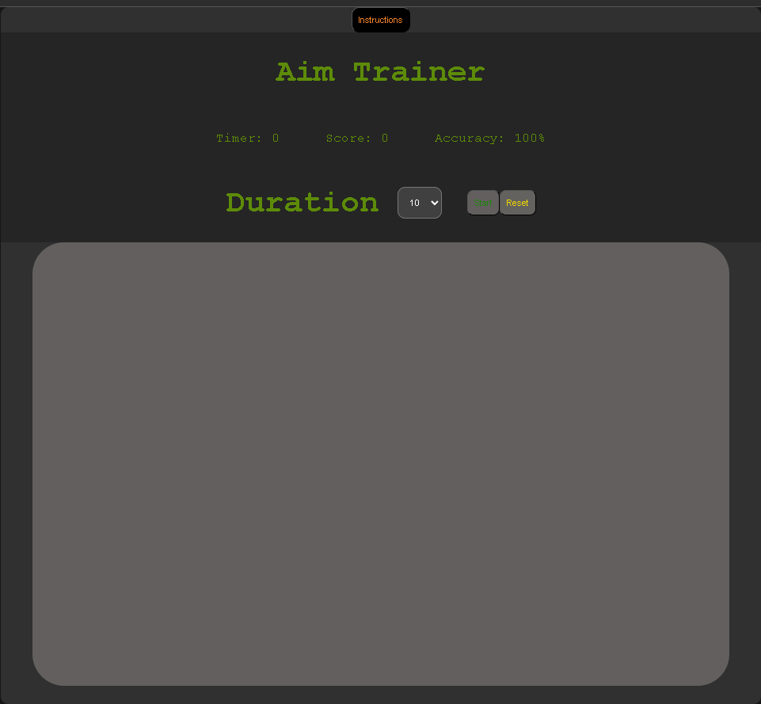

# Aim trainer

## Game Sample

## Description / Purpose

My app is called Aim trainer. It's a reaction and aiming training aid. 1 player can attempt to target and click dots that appear on screen as fast as they can to train for fps games. The game will track targets clicked within the adjustable time limits and display a total of the targets clicked so that users can compare their scores for progress tracking.

I chose to make this app because I wanted a practical and useful tool that also illustrated my current expertise with JS, CSS, and HTML.

#### Stretch Goals

- Targets have exploding animation when shot.
- Targets move around on canvas.
- Adjustable difficulties (target size, targets dissappear after short time, targets must be clicked in order they appeared).
